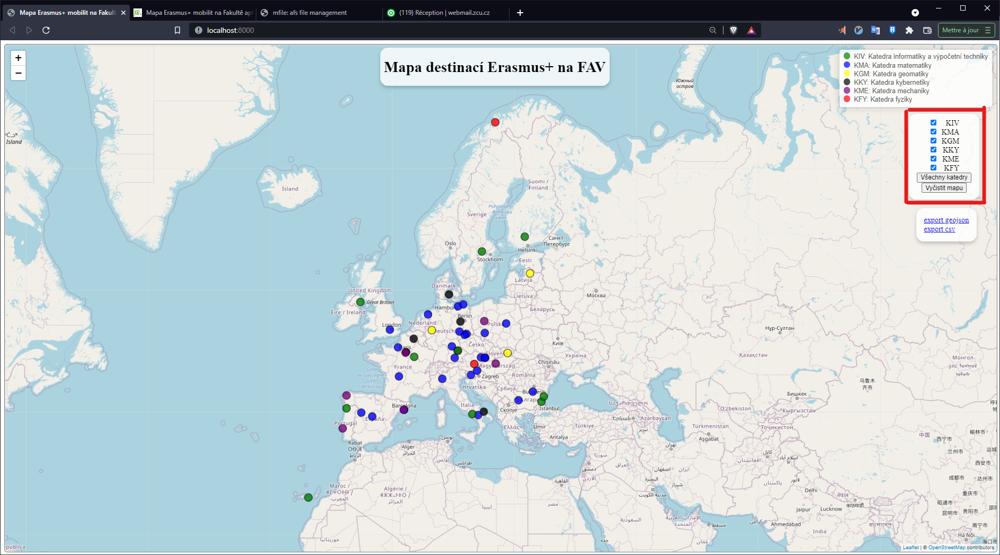
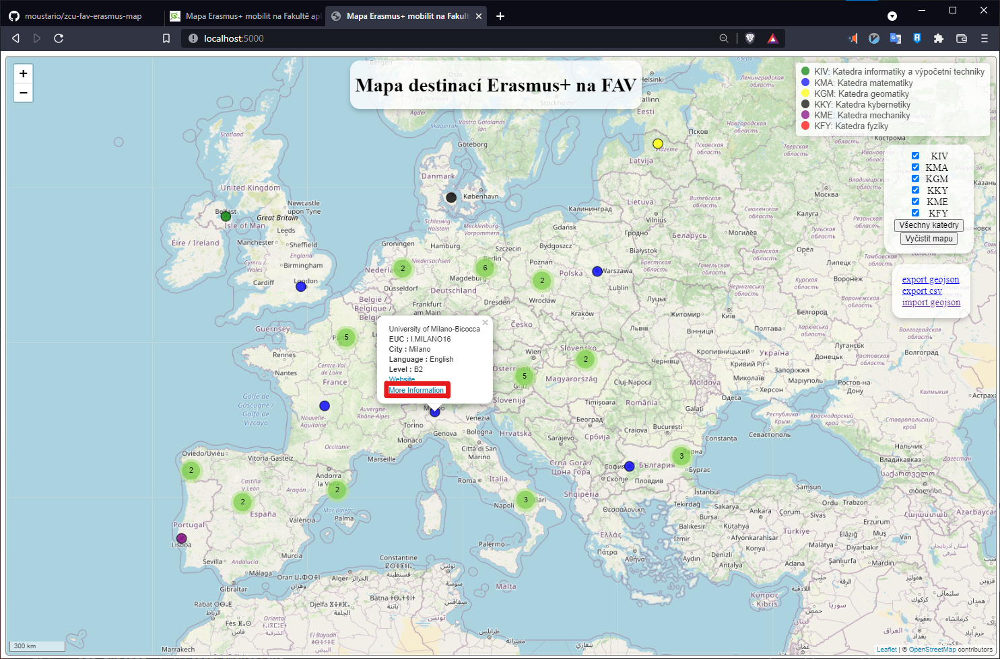
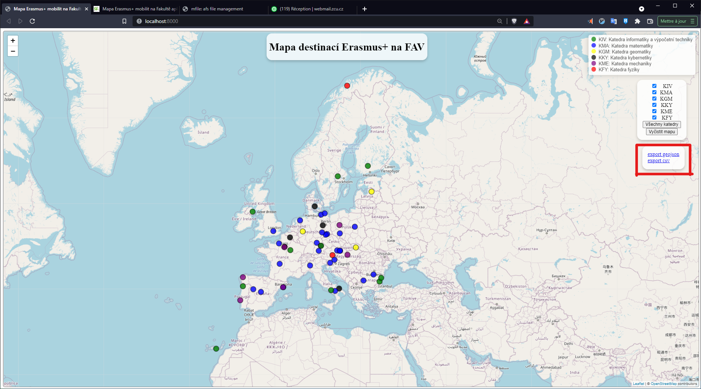
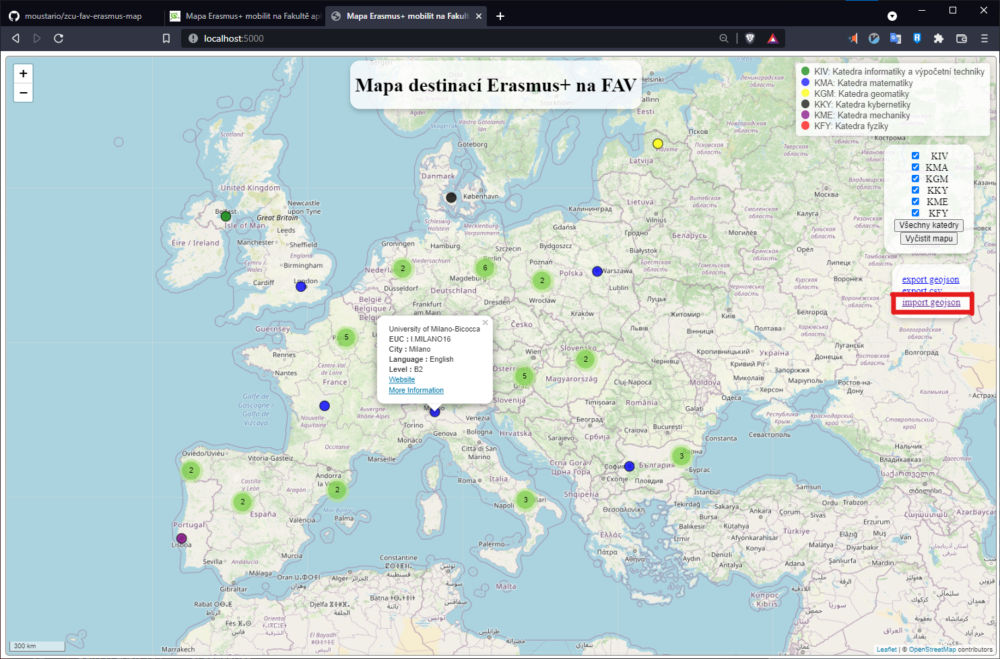

# ZCU FAV erasmus map

The goal of this project is to display the ZCU FAV faculty partnerships through the erasmus program.

It consist of a small web app using a flask (python) server for operations not available through client side ( leafleat and vanilla javascript) rendering.

## Features

### Display specific departments partnerships

Using the checkbox the using can adjust which department is currently shown.

### Edit data of the different partnership

Using the "More information" link a form page is avalaible in which the user can change the university data.

### Export the data to csv and geojson

Files exports are available through the following links.

### Import his own file

The app can also import a geojson file correctly formatted. It will also automatically sync the other source files.

## Data

Source data files must be placed in a "sources" folder in the static folder.
They can be updated through the 'upload' page.

## Dependecies

To install python depencies.

> pip install -r ./requirements.txt

## To run

The project uses a small flask server to run on windows using powershell :

Declare the app

> $env:FLASK_APP = "erasmusMap"

_Optional_ : To enable dev server (hot realoads ...)

> $env:FLASK_ENV = "development"

To run the app

> flask run

**note that the first two step are only perfomed once at the first run of the app.**

[Official flask documentation.](https://flask.palletsprojects.com/en/2.0.x/quickstart/)